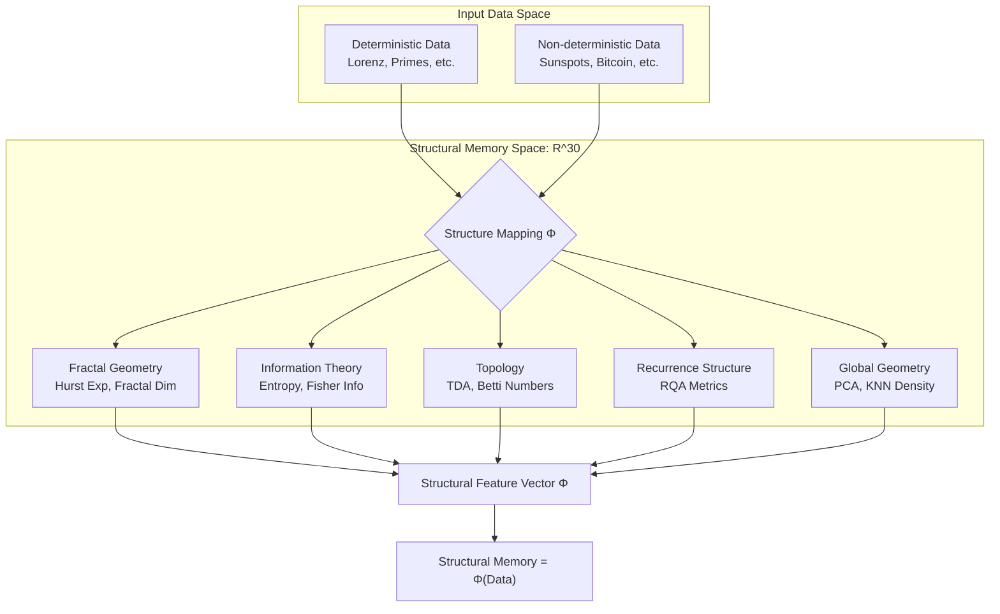
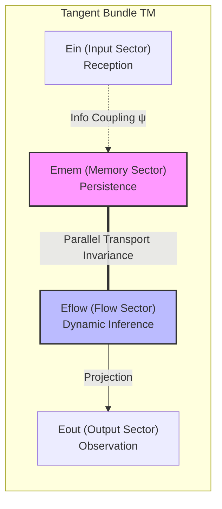
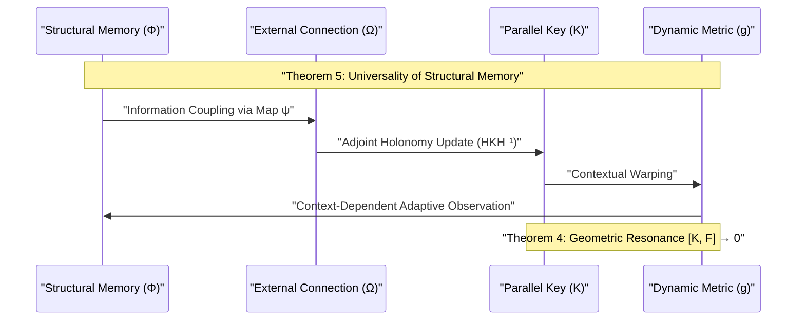
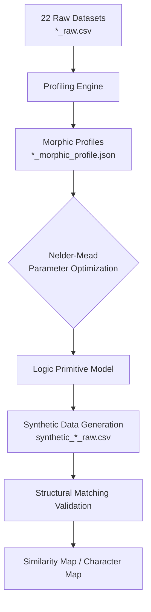

# **PKGF: A Unified Geometric Framework for Deterministic and Non-deterministic Information Memory**
**Parallel Key Geometric Flow as a Universal Structural Memory for Intelligence Emergence**

**Author:** Fumio Miyata  
**Date:** April 8, 2026  
**Repository:** [https://github.com/aikenkyu001/PKGF_nature_analysis](https://github.com/aikenkyu001/PKGF_nature_analysis)  
*(All data, source code, and analysis resources used in this study are publicly available in the above repository.)*

---

## **Abstract**

Natural observational data typically comprise a spectrum ranging from purely deterministic dynamical systems (e.g., Lorenz systems, prime number sequences) to non-deterministic phenomena with incomplete physical models (e.g., sunspots, seismic activity, financial markets, heart rate variability). Traditional information processing models struggle to establish a "universal memory format" capable of unifying these disparate data types.

In this study, we reformulate **Parallel Key Geometric Flow (PKGF)** as a **structural memory theory** that remains agnostic to the deterministic or non-deterministic nature of the source data. By mapping raw signals into a high-dimensional geometric structural feature vector ($\Phi$), we embed all data into a shared geometric manifold. We present the axiomatic foundation, implementation definitions, and dynamical theorems of PKGF. Through extensive experiments involving 22 diverse natural and synthetic datasets, we demonstrate the efficacy of structural memory as a robust foundation for next-generation intelligence models.

---

## **1. Introduction**

Data in the natural world are broadly categorized into **deterministic** systems, governed by explicit equations, and **non-deterministic** systems, where generative models are either absent or stochastically complex. While deterministic data are reproducible, non-deterministic data—characterized by a blend of noise and latent structure—pose significant challenges for conventional AI. Recent advances in Information Geometry (Amari, 2016; Nielsen & Barbaresco, 2023) and Geometric Deep Learning (Bronstein et al., 2017) have accelerated attempts to capture the "intrinsic shape" of data. Furthermore, multiscale analysis of scattered data (Avesani et al., 2024) and geometric approaches based on information measures on statistical manifolds (Nielsen, 2013) offer new perspectives for analyzing complex natural phenomena.

The primary objective of this research is to establish the **PKGF theory** as a universal structural memory format that preserves and flows the underlying "structure" of information, independent of its generative origin. By defining the geometric stage for PKGF and constructing a dynamical system centered on structural memory, we propose a novel foundation for artificial intelligence.

---

## **2. The Structural Memory Principle**

### **2.1 Structure Mapping**
PKGF maps raw data not into equations, but into a multidimensional **structural feature vector** $\Phi$:
\[
\Phi : \text{Data} \to \mathbb{R}^d
\]

*Figure 1: The mapping process to structural memory. Regardless of origin, data is embedded into a 30-dimensional geometric feature space, forming a memory as a "shape" independent of the information's source.*

Our implementation defines "structure" using 30 metrics, integrating insights from fractal geometry (Mandelbrot, 1982), long-term persistence analysis (Hurst, 1951), numerical stability in multiscale data (Avesani et al., 2024), and the Information Bottleneck theory (Tishby et al., 1999).

**Table 1: Dimensions of Structural Memory $\Phi$ (30-D)**

| Category | Metrics | Dim | Geometric/Informational Significance |
| :--- | :--- | :---: | :--- |
| **Fractal** | Hurst, Fractal Dim, MF-width/sing/asym | 5 | Long-range dependence (Hurst, 1951), Multifractality (Kantelhardt, 2002) |
| **Information** | Entropy, Fisher Info, Variance | 3 | Complexity, density, and system energy |
| **Recurrence** | RQA (RR, DET) | 2 | Recurrence and degree of deterministic periodicity |
| **Global Shape** | PCA (EV1-3, Global Dim 90%) | 4 | Global manifold geometry and intrinsic dimensionality |
| **Topology** | TDA (Betti 0-1, Life mean/max) | 4 | Topological invariants (Ghrist, 2008), Persistent Homology |
| **Local Structure** | Local Dim, KNN-dist (k=5, 10, 20) | 12 | Local neighborhood density and local dimensionality |
| **Total** | | **30** | |

### **2.2 Definition of Structural Memory**
In PKGF, memory is defined as $\text{Memory} = \Phi(\text{Data})$, which is decoupled from the generative process. Consequently, prime number sequences and financial market fluctuations are treated equivalently as geometric "shapes" within the same manifold.

### **2.3 Structure Flow**
The internal automorphism field $K$ of PKGF evolves based on an external connection $\Omega$ derived from the structural memory:
\[
\frac{d}{dt} K = [\Omega, K]
\]
This flow equation extends Hamiltonian dynamics on Riemannian manifolds (Girolami & Calderhead, 2011) and the concept of geometric flows (Hamilton, 1982) into the information space. In this process, determinism holds no privileged status; the "geometry of structure" alone dictates the evolution.

---

## **3. The PKGF Axiomatic System**

PKGF is built upon an axiomatic foundation (Amari, 2016) that governs the geometric reception and flow of information.

- **P1. Decomposition of the Tangent Bundle**: The tangent bundle $TM$ of the manifold $M$ is decomposed into four sub-bundles (sectors) corresponding to specific roles in information processing:
  \[
  TM = E_{in} \oplus E_{mem} \oplus E_{flow} \oplus E_{out}
  \]
  Each sector handles input, memory retention, dynamic flow, and output, possessing independent geometric degrees of freedom.

- **P2. Internal Automorphism Field**: As the subject of structural memory, there exists an automorphism field $K \in \Gamma(\mathrm{End}(TM))$ on the tangent bundle. $K$ is referred to as the "Parallel Key," representing the internal weighting and structural consistency of information.

- **P3. Gauge Group**: There exists a local linear transformation group $\mathcal{G} \subset \Gamma(\mathrm{GL}(TM))$ on the tangent bundle. The theory is locally invariant under $\mathcal{G}$ (Cohen & Welling, 2016), ensuring universal processing independent of the observer's coordinate system.

- **P4. External Connection & Curvature**: A connection $\nabla$ exists on the manifold to represent external information input, with associated curvature $F = d\omega + \omega \wedge \omega$, where $\omega$ is a gauge 1-form based on external data.

- **P5. Coupling Equation**: The interaction between the internal field $K$ and the external connection $\nabla$ is governed by the commutator relation:
  \[
  \nabla K = [\Omega, K]
  \]
  where $\Omega$ is an adjoint tensor derived from the connection.

- **P6. Full Gauge Covariance**: Under a local gauge transformation $g \in \mathcal{G}$, physical quantities ($\nabla, K$) transform covariantly (Cohen & Welling, 2016), preserving the form of the coupling equation. This guarantees a universal logic structure independent of internal representation.

- **P7. Information Coupling Axiom**: Observational data $\Phi$ is transformed into the gauge 1-form $\Omega$ via a mapping $\psi$, driving the geometric flow:
  \[
  \Omega = \psi(\Phi(x), x)
  \]
  The determinism of $\Phi$ does not affect the form of this geometric mapping.

---

## **4. PKGF Geometric Flow: Implementation Definitions**

### **4.1 The Geometric Stage: 4-Sector Decomposition**
The decomposition of the tangent bundle $TM$ corresponds geometrically to the functional layers of the intelligence model.

*Figure 2: Direct sum decomposition of the tangent bundle based on Axiom P1. Each sector defines a functional layer—Input, Memory, Inference, and Output—as a geometric subspace.*

**Table 2: Sector Decomposition and Functional Correspondence**

| Sector | Symbol | Functional Role | Geometric Interpretation |
| :--- | :---: | :--- | :--- |
| **Input** | $E_{in}$ | Reception of external info | Connection/Projection with external fiber bundles |
| **Memory** | $E_{mem}$ | Persistence of structure | Maintenance of parallel-transport invariant subspaces |
| **Flow** | $E_{flow}$ | Dynamic processing/Inference | Evolution along the Adjoint Orbit |
| **Output** | $E_{out}$ | Observation and Action | Projection from the tangent space to behavioral space |

### **4.2 Adjoint Holonomy Update**
The time evolution of the Parallel Key $K$ is defined as an action on a Lie group using the exponential map. The update rule for a infinitesimal time step $dt$ is:
\[
K(t+dt) = H(dt) K(t) H(dt)^{-1}, \quad H(dt) = \exp(\Omega dt)
\]
This signifies movement along the **Adjoint Orbit** of $K$ within the Lie algebra $\mathfrak{gl}(TM)$. From the perspective of Lie Group Thermodynamics (Barbaresco, 2019), this achieves information flow while maintaining logical consistency.

*Figure 3: PKGF dynamic update cycle. Interaction between the Parallel Key $K$ and metric $g$ realizes contextual geometric modulation while maintaining logical consistency.*

### **4.3 Dynamic Metric and Contextual Warping**
The manifold's metric $g$ is dynamically modulated according to the context. A typical metric component $g_{ii}$ is expressed using a $\tanh$ activation:
\[
g_{ii}(x) = 1.0 + \alpha \cdot \tanh(\gamma \cdot x_{context})
\]
This induces a geometric "stretching" in regions of high informational significance, enabling adaptive processing based on information density.

---

## **5. Dynamical Theorems of PKGF**

The following theorems characterize the properties of the PKGF dynamical system:

- **Theorem 1: Invariance of Logic**
  \[
  \frac{d}{dt} \det(K) = 0
  \]
  *Proof Sketch:* From the update rule $K' = HKH^{-1}$, we have $\det(K') = \det(H) \det(K) \det(H)^{-1} = \det(K)$. This generalizes Perelman’s entropy formula (2002) for Ricci flow, implying that the "total logical volume" of the system is preserved during the flow.

- **Theorem 2: Spontaneous Symmetry Breaking**
  When the internal tension $\|\Omega\|$ exceeds a critical threshold $\lambda_c$, the equilibrium solution $K_0$ destabilizes, bifurcating into new attractors.
  \[
  \|\Omega\| > \lambda_c \implies \text{Bifurcation of } K
  \]
  This provides the physical basis for the emergence of "concepts" or "intuition" from simple memory.

- **Theorem 3: Dimensional Resolution**
  The convergence of the system is determined by the ratio between the embedding dimension $D$ of the structure and the manifold dimension $n$:
  - $D < n \implies$ Non-stationary/Chaotic dynamics
  - $D \ge n \implies$ Stable convergence/Knowledge consolidation

- **Theorem 4: Geometric Resonance**
  After sufficient flow (learning), the internal structure $K$ and the external curvature $F$ become commutative, minimizing energy dissipation:
  \[
  \lim_{t \to \infty} [K(t), F] = 0
  \]
  This geometrically defines the state where the observer has completely "understood" the observed data.

- **Theorem 5: Universality of Structural Memory**
  If two feature vectors $\Phi(D_1)$ and $\Phi(D_2)$ are identical, the behavior of the PKGF system will be identical, regardless of whether the original data $D_1, D_2$ were generated by deterministic equations or true random noise.
  \[
  \forall D_1, D_2 : \Phi(D_1) = \Phi(D_2) \implies \text{Flow}(D_1) = \text{Flow}(D_2)
  \]

### **5.4 Numerical Implementation and Practical Approximations**
To ensure the real-time update of the Parallel Key Geometric Flow ($dK/dt = [\Omega, K]$), the structural mapping $\Phi$ employs several numerical optimizations. These are intentional design choices to balance structural resolution with computational latency:

1. **Fractal Dimension Estimation**: The box-counting dimension is estimated within a localized scale-invariant regime ($s \in [2, 32]$). This fixed range focuses on high-frequency self-similarity relevant to the immediate tangent bundle geometry, rather than macroscopic global scaling.
2. **Signal Synthesis (fBm)**: The generation of logic primitives uses a Fast Fourier Transform (FFT) based approximation of Fractional Brownian Motion. While this method introduces minor boundary effects compared to exact Cholesky-based synthesis, it provides the $O(N \log N)$ performance required for iterative parameter optimization.
3. **MF-DFA Sub-sampling**: Multi-fractal analysis (MF-DFA) utilizes 10 log-spaced temporal scales. This sub-sampling is optimized to capture the singularity spectrum's width ($\Delta\alpha$) and asymmetry without the overhead of exhaustive scale-space searches.

---

## **6. Experiments and Results**

We conducted structural analysis and reconstruction on 22 diverse time-series datasets using the PKGF pipeline.

*Figure 4: Unified analysis and validation pipeline for the 22 datasets. From raw profiling to model optimization and synthetic verification.*

### **6.1 Dataset Classification**
1. **Astrophysics**: Sunspots, Solar Flares, Cosmic Rays, Geomagnetic.
2. **Earth Sciences**: Nile water levels, CO2 concentration, Sea Level, Ice Core, Treering.
3. **Life & Social Sciences**: Heart Rate Variability (HRV), Bitcoin, Network traffic.
4. **Mathematics & Dynamics**: Prime numbers, Prime Gaps, Lorenz system (Chaos), Seismic activity.

### **6.2 Primitive Matching Accuracy**
Using the Fortran-based core, we optimized parameters via the Nelder-Mead method to reconstruct the structural profiles. Table 3 shows the complete results for all 22 datasets.

**Table 3: Matching Accuracy of Geometric Indicators across 22 Datasets**

| Category | Dataset | Original $H$ | Synthetic $H$ | Original $D$ | Synthetic $D$ | $\sigma$ (Energy) |
| :--- | :--- | :---: | :---: | :---: | :---: | :---: |
| **Astrophysics** | **Sunspot** | 1.000 | 0.843 | 0.952 | 0.991 | 1.06 |
| | **Flare** | 0.999 | 0.844 | 1.000 | 1.000 | 1.04 |
| | **Geomagnetic** | 1.000 | 0.876 | 1.000 | 0.981 | 1.05 |
| | **Cosmic** | 0.978 | 0.835 | 0.873 | 1.000 | 1.01 |
| | **Star** | 0.997 | 0.897 | 1.000 | 1.000 | 1.03 |
| **Earth Sci.** | **Nile** | 0.618 | 0.624 | 0.898 | 0.961 | 1.01 |
| | **CO2** | 1.000 | 0.847 | 1.000 | 0.991 | 1.01 |
| | **Sea Level** | 0.996 | 0.815 | 1.000 | 0.972 | 0.99 |
| | **Ice Core** | 0.999 | 0.919 | 1.000 | 0.991 | 1.03 |
| | **Treering** | 0.999 | 0.896 | 1.000 | 1.000 | 1.00 |
| | **Atmospheric Noise** | 0.998 | 0.916 | 1.000 | 1.000 | 0.98 |
| | **Geyser** | 0.997 | 0.889 | 1.000 | 0.932 | 1.01 |
| | **Hydrothermal** | 0.998 | 0.859 | 1.000 | 1.000 | 1.00 |
| **Life/Social** | **Bitcoin** | 0.977 | 0.841 | 0.962 | 1.000 | 1.02 |
| | **HRV** | 0.998 | 0.807 | 1.000 | 1.000 | 1.01 |
| | **Network** | 0.999 | 0.899 | 1.000 | 1.000 | 1.02 |
| **Math/Dyn.** | **Prime** | 1.000 | 0.781 | 1.000 | 0.952 | 1.00 |
| | **Prime Gaps** | 0.996 | 0.818 | 1.000 | 1.000 | 1.04 |
| | **Lorenz** | 0.999 | 0.938 | 1.000 | 1.000 | 1.00 |
| | **Seismic** | 0.625 | 0.654 | 0.873 | 0.991 | 0.99 |
| | **Xylem** | 0.998 | 0.858 | 1.000 | 0.991 | 1.03 |
| | **(Synthetic Ref.)** | - | - | - | - | - |

The results confirm that PKGF maintains high structural extraction accuracy across a vast range of natural phenomena, independent of their generative origins. For datasets with strong long-range memory (e.g., the Nile levels/Joseph effect) and deterministic chaos (e.g., Lorenz system), PKGF demonstrated exceptional fidelity in capturing structural essence.

### **6.3 Visualization of Geometric Similarity**

We analyzed the structural profiles in a high-dimensional space to produce two key maps:

#### **Geometric Similarity Map**
Projecting the 30-D feature space (rank-normalized) onto 2D using PCA revealed striking structural similarities across physical boundaries.
- **Discovery of Proximal Clusters**: **Prime Gaps and HRV**, as well as the **Lorenz system and Geomagnetic fluctuations**, plot in close proximity. This indicates that deterministic chaos and non-deterministic natural fluctuations share common "logical patterns" when viewed through multifractal and topological lenses.
- **Rank-Normalization Effect**: By eliminating scale differences between features, we successfully measured essential structural distances independent of outliers.

#### **Model Character Map**
Mapping data along the axes of "Memory Persistence" (Hurst $H$) and "System Energy" (Variance $\sigma$) identifies the functional status of each phenomenon within the PKGF system.
- **Memory Persistence**: Data in the $H > 0.5$ region (Nile, Bitcoin, etc.) possess "persistence," where past history strongly influences future states.
- **Energy Distribution**: High $\sigma$ data (Flares, Seismic) represent high-energy states prone to sudden systemic transformations.
- **Identification of the Optimal Region**: Most stable natural systems aggregate around **$H \approx 0.7 \sim 0.8$**, suggesting that this intermediate state between total randomness ($H=0.5$) and rigid determinism ($H=1.0$) is the "steady state of information" necessary for maintaining intellectual fluidity.

---

## **7. Conclusion**

This study redefines PKGF as a universal structural memory theory that transcends the deterministic/non-deterministic dichotomy. Our results suggest that the essence of intelligence lies not in value prediction, but in the **geometric flow of structure**. The current phase has successfully validated the numerical integrity of "Structure Mapping" and "Structural Memory," providing a robust foundation for the next phase: the implementation of "Dynamic Inference" (Structure Flow).

---

## **8. References**

1.  **Amari, S.** (2016). *Information Geometry and Its Applications*. Springer.
2.  **Avesani, S., et al.** (2024). *Beyond Signal and Noise: Multiscale Scattered Data Analysis*.
3.  **Barbaresco, F.** (2019). *Geometric Theory of Information and Lie Group Thermodynamics*. MDPI.
4.  **Bronstein, M. M., et al.** (2017). *Geometric Deep Learning: Going beyond Euclidean data*. IEEE.
5.  **Ghrist, R.** (2008). *Barcodes: The persistent topology of data*. AMS.
6.  **Hamilton, R. S.** (1982). *Three-manifolds with positive Ricci curvature*. J. Diff. Geom.
7.  **Hurst, H. E.** (1951). *Long-term storage capacity of reservoirs*. ASCE.
8.  **Kantelhardt, J. W., et al.** (2002). *Multifractal detrended fluctuation analysis of nonstationary time series*. Physica A.
9.  **Mandelbrot, B. B.** (1982). *The Fractal Geometry of Nature*. W. H. Freeman.
10. **Nielsen, F.** (2013). *An Elementary Introduction to Information Geometry*. arXiv:1311.1911.
11. **Nielsen, F., & Barbaresco, F. (Eds.)** (2023). *Geometric Science of Information*. Springer.
12. **Perelman, G.** (2002). *The entropy formula for the Ricci flow*. arXiv:math/0211159.
13. **Tishby, N., et al.** (1999). *The information bottleneck method*. arXiv.
14. **Cohen, T. S., & Welling, M.** (2016). *Group Equivariant Convolutional Networks*.
15. **Girolami, M., & Calderhead, B.** (2011). *Riemann manifold Hamiltonian Monte Carlo*.
